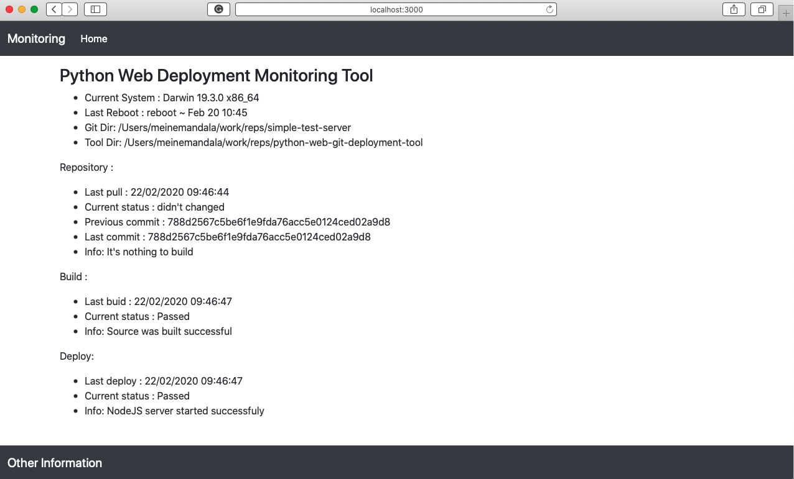

# Python monitoring tool to build and deploy git code

## IN PROGRESS

This application is writing as tool to build and deploy some repository on the server. The tool is the web monitor shows current state passed pulled git requests, build and started NodeJS server. 
For this tool we used:
- ***Python 3 and library GitPython*** as backend
- [***JavaScript - spa-mvc-router***](https://github.com/eugenemdev/spa-mvc-router) as frontend
- ***bash code*** with recomendations how to make own systemctl service

## [View the demo]() ... soon!

## How run this app
- Build Frontend:  `npm run build`
- Start Python Server `python3 start.py`

## Author

- [Eugen Morozov](https://eugenmorozov.de)